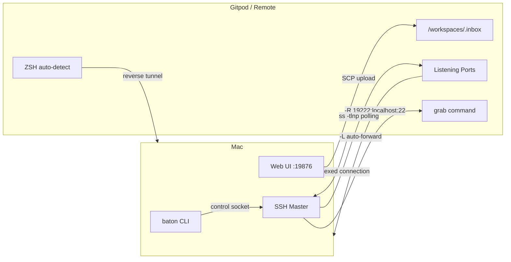
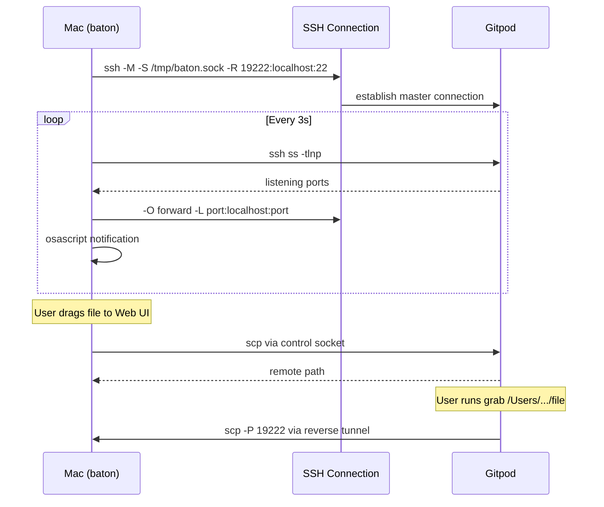
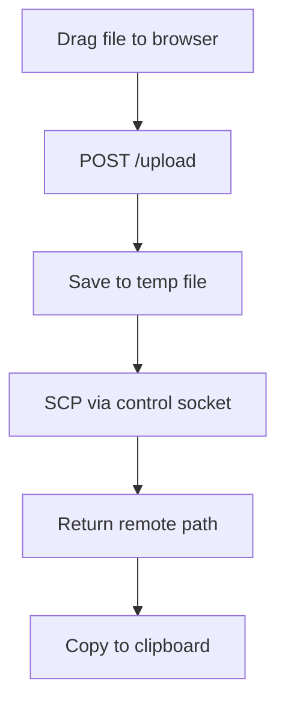

# baton

A Mac-side CLI that bridges your local machine and a remote Gitpod/SSH workspace. Drop files from Finder, get auto port forwarding — no more opening Cursor just for its tunnel.

## Architecture



## How It Works



## Install

### Build from source

```bash
# On Gitpod (cross-compile for macOS ARM64)
make build-mac

# Copy to your Mac
scp baton-darwin-arm64 your-mac:~/bin/baton
chmod +x ~/bin/baton
```

### Prerequisites (Mac)

1. **Remote Login** enabled: System Settings → General → Sharing → Remote Login
2. **SSH key** from your Gitpod instance added to `~/.ssh/authorized_keys` on Mac
3. **SSH config** entry for your workspace

## Usage

### Connect

```bash
# First time — pass host and preset
baton connect workspace-id@gitpod.io --preset orchestra

# Next time — just run connect (host + preset restored from .baton.toml)
baton connect
```

Starts over one multiplexed SSH connection:
- **Reverse tunnels** push local services (MySQL, Caddy, etc.) to the remote
- **Auto port forwarder** scanning remote ports every 3s
- **Reverse tunnel** (port 19222) for remote file pulling

Settings are saved to `.baton.toml` on each connect, so subsequent runs don't need arguments.

### Presets

Presets define groups of reverse tunnels (local → remote). The built-in `orchestra` preset forwards:

| Port | Service |
|------|---------|
| 443 (→4443) | Caddy entrypoint |
| 3000 | portcullis-ui |
| 3306 | MySQL |
| 5432 | PostgreSQL |
| 6007 | Storybook |
| 8000 | data-service |
| 9000 | portcullis-api |
| 9010–9050 | microservices (protocoldescriber, entityresolver, etc.) |

Custom presets can be defined in `.baton.toml`:

```toml
[presets.myapp]
desc = "My app services"
reverse = [3000, 5432, 8080]
ports = [4200]
```

### Send a file

```bash
baton send ./presentation.pdf
# /workspaces/.inbox/presentation.pdf
# (copied to clipboard)

baton send ./data.csv /tmp/
# /tmp/data.csv
```

### Check forwarded ports

```bash
baton ports
# forwarded ports:
#   localhost:3000 → remote:3000
#   localhost:8080 → remote:8080
```

### Status / Disconnect

```bash
baton status
baton disconnect
```

## Web UI

Open `http://localhost:19876` after connecting. Drag files from Finder onto the drop zone — they upload via SCP and you get the remote path.



## Remote Shell Integration

### `grab` command

Pull files from your Mac directly in the remote terminal:

```bash
# Install on remote
source /path/to/remote/grab.sh

# Usage
grab /Users/you/Desktop/mutation.html
# → /workspaces/.inbox/mutation.html
```

### ZSH auto-detect

Source the plugin in your remote `.zshrc`:

```bash
source /path/to/remote/baton.plugin.zsh
```

Now when you drag a file from Finder into the terminal, the Mac path is intercepted, the file uploads via the reverse tunnel, and the pasted path is replaced with the remote path.

## Configuration

Config is auto-saved to `.baton.toml` in the current directory on each connect. You can also create one manually:

```toml
[connection]
host = "workspace-id@gitpod.io"
preset = "orchestra"
reverse_port = 19222
control_socket = "/tmp/baton.sock"

[transfer]
inbox = "/workspaces/.inbox"
mac_user = "ngj49"

[ports]
scan_interval = "3s"
exclude = [22, 19222]

[presets.orchestra]
desc = "Orchestra platform services"
reverse = [443, 3000, 3306, 5432, 6007, 8000, 9000, 9010, 9020, 9030, 9040, 9050]
```

Config lookup order: `.baton.toml` (current dir) → `~/.baton.toml` (home). The local file is gitignored.

## Environment Variables (Remote)

| Variable | Default | Description |
|----------|---------|-------------|
| `BATON_PORT` | `19222` | Reverse tunnel port |
| `BATON_MAC_USER` | *(from path)* | Mac username for SCP |
| `BATON_INBOX` | `/workspaces/.inbox` | Default upload destination |

## License

MIT
